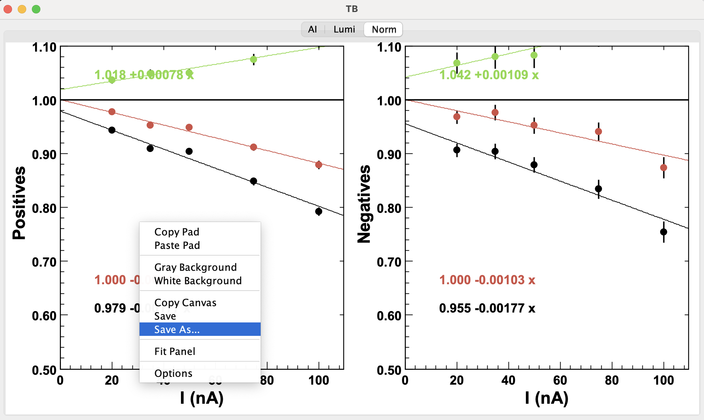

# RG-D Network Training and Validation

## Objective
This project provides a detailed explanation of how to train neural networks for the CLAS12 Forward Drift Chamber (DC) and includes Python scripts to generate validation plots.

## Installation
This project is written in Python. All required dependencies are listed in the pyproject.toml file.

## Network Training
The training is performed using the [CLAS12 AI Tools](https://clasweb.jlab.org/wiki/index.php/CLAS12_AI_tools) (`j4np`), a package designed for training and testing neural networks for track classification. You can download the latest version [here](https://userweb.jlab.org/~gavalian/software/j4np/).

### Step 1: Prepare Training Data

Training data must be generated from cooked files that contain the `TimeBasedTrkg::TBClusters` and `TimeBasedTrkg::TBTracks` banks. To produce these banks, cooking must be done using the `dcalign` schema, as demonstrated in the [`rg_data-aicv.yaml`](rg_data-aicv.yaml) file.

For RG-D (April 2025), the training runs used were:
- **Inbending:** Run `18335`
- **Outbending:** Run `18435`


Generate the training dataset with:

```bash
./bin/j4np.sh clas12ml -extract -o outputname_ai -max 75000 /volatile/clas12/rg-d/production/ainet/path-to-run/*
```

This will create two files:
- outputname_ai_tr.h5 (training set)
- outputname_ai_va.h5 (validation set)

### Step 2: Train the Network
To train both the classifier and autoencoder, run:
```bash
./bin/j4np.sh clas12ml -train -a networkname.network -r 18305 -t outputname_ai_tr.h5 -v outputname_ai_va.h5 -e 1250 -max 25000
```
Where:
- -e: number of epochs (default: 125)
- -max: maximum number of training tracks (default: 45000)
- -a: output archive filename (.network)
- -r: run number used in YAML config
- -t: training HDF5 file
- -v: validation HDF5 file

### Step 3: Inspect Training Results
Launch the graphical tool to review training results:
```bash
./bin/j4shell.sh 
jshell> TwigStudio.groupBrowser("networkname.network");
```

## Network Validation

After training, you can validate the network using the [AI Tracking Validation Tool](https://github.com/raffaelladevita/aiTracking), which compares conventional and AI-assisted tracking.

### Build and Run the Validation Tool
Clone and compile the tool:
```bash
git clone https://github.com/raffaelladevita/aiTracking
```
Go to the folder aiTracking and compile with maven:
```bash
cd aiTracking
mvn install
```
Run the code with:
```bash
./bin/aiTracking
```

### Step 1: Cook the Validation Runs
Cook a small number of EVIO files (typically ~5 per run) using the same YAML structure as in training, but update the network path:
```yaml
service:
  MLTD:
   network: "/path/to/the/file.network"
```
Also enable the denoising option to improve tracking, both conventional and AI:
```yaml
DCCR: 
  rawBankGroup: "NODENOISE"
```

Luminosity scan runs used:
- Inbending LD2: 18318, 18319, 18321, 18324, 18325, 18326 (currents: 5, 20, 35, 50, 75, 100 nA)
- Outbending LD2: 18427, 18429, 18431, 18432 (currents: 20, 30, 50, 75 nA)
- Inbending CuSn: 18348, 18394, 18354, 18372, 18373 (currents: 100, 110, 130, 150, 175 nA)

### Step 2: Process Each Run
Process individual runs to create validation .hipo files:
```bash
./bin/aiTracking ./bin/aiTracking -plot 0 -o output_prefix /volatile/path/to/one/validation/run
```
This command should be executed for each run.

### Step 3: Perform Luminosity Scan Analysis
Once all runs are processed, combine them into a luminosity scan analysis:
```bash
./bin/aiTracking -histo 1 -lumi "2:data,5:data,10:data,20:data,40:data" 2nA_histo_file.hipo 5nA_histo_file.hipo 10nA_histo_file.hipo 20nA_histo_file.hipo 40nA_histo_file.hipo
```


## Plotting Results

To generate comparison plots using the validation output:

1. Save the normalized plots as .txt files from the GUI:


2. Use the `helper.plot_comparison()` function provided in the Jupyter notebook::
```Python
helper.plot_comparison(
    path1="data/OBLD2NoDenMO", 
    path2="data/OBLD2NoDenDM",
    label1="MO",
    label2="DM",
    title="Comparison of OBLD2 NoDen MO and DM",
    save_name="plots/comparison_OBLD2NoDen_MO_DM",
)
```